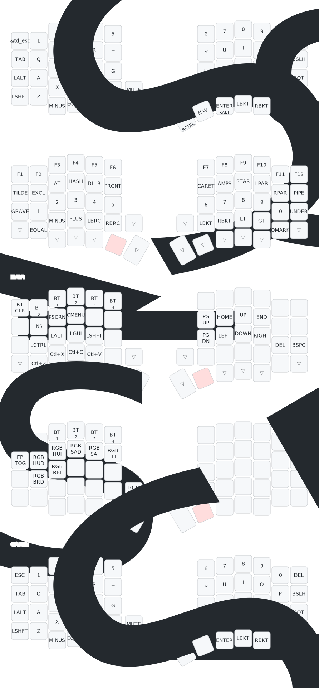

# Sofle V2 Wireless | ZMK Firmware

> A beginner-friendly, smart keymap for the Sofle V2 split ergonomic keyboard, optimized for programming and typing workflows.

[](https://github.com/thuanc177/sofle-v2-oled-zmk-firmware/actions/workflows/build.yml)

---

## Overview

This is a **ZMK firmware configuration** for the Sofle V2 split keyboard running on **nice!nano** controllers. It features a carefully designed 4-layer keymap with modern ergonomic improvements:

- **Home row mods** (CAGS order) for effortless modifier access
- **Vim-style HJKL navigation** on the NAV layer
- **Programming-optimized symbol placement** with numbers on home row
- **Tap-dance behaviors** for frequently paired keys
- **Thumb-centric layer switching** for natural hand positioning
- **OLED display support** with custom widgets
- **Dual rotary encoders** for volume and scroll control
- **5 Bluetooth profiles** for multi-device switching

---

## Features

| Feature | Description |
|---------|-------------|
| **Controllers** | nice!nano v1/v2 (nRF52840) |
| **Connectivity** | Bluetooth 5.0 with 5 profiles |
| **Display** | 128x32 OLED (SSD1306) |
| **Encoders** | 2x EC11 rotary encoders |
| **Layers** | 4 layers (BASE, SYM, NAV, ADJUST) |
| **Home Row Mods** | CAGS order with anti-misfire tuning |
| **RGB Underglow** | Supported but disabled by default |
| **Power Management** | Deep sleep, external power control |

---

## Keymap Visualization



**[Open in Keymap Editor →](https://nickcoutsos.github.io/keymap-editor)**

---

## Layer Reference

### Layer 0: BASE (QWERTY)

Your default typing layer with **home row mods** for effortless modifier access.

| Position | Left Hand | Right Hand |
|----------|-----------|------------|
| **Home Row** | `A` (Ctrl), `S` (Alt), `D` (GUI), `F` (Shift) | `J` (Shift), `K` (GUI), `L` (Alt), `;` (Ctrl) |
| **Thumbs** | `-`, `=`, `Alt`, **SYM**, `Space` | `Backspace`, `Enter`, **NAV**, `[`, `]` |
| **Encoders** | Left: Volume Up/Down | Right: Page Up/Down |

**Key behaviors:**
- **Home row mods**: Hold `A`/`S`/`D`/`F` for 200ms to activate modifiers
- **Tap-dance `/`**: Single tap = `/`, double tap = `\`
- **Combo ESC**: Press `U+I` together for Escape
- **Encoder press**: Left = Mute, Right = Play/Pause

---

### Layer 1: SYM (Symbols & Numbers)

Activated by **holding left thumb (SYM key)**. Optimized for programming with paired brackets and numbers on home row.

**Highlights:**
- **F-keys** across top row (F1–F12)
- **Shifted symbols** on row 2: `!@#$%^&*()`
- **Numbers on home row** (1–0) for fast access without shifting hand
- **Paired brackets** logically grouped: `{}` left bottom, `[]` right bottom, `<>` right
- **Underscore `_`** on right home row pinky (common in code)

**Why numbers on home row?**  
Eliminates reaching to the top row when typing numeric values or identifiers.

---

### Layer 2: NAV (Navigation & Clipboard)

Activated by **holding right thumb (NAV key)**. Vim-style arrows + clipboard shortcuts.

**Highlights:**
- **HJKL Vim arrows** on right home row: `H`=Left, `J`=Down, `K`=Up, `L`=Right
- **Clipboard shortcuts** on left bottom row: `Z`=Undo, `X`=Cut, `C`=Copy, `V`=Paste
- **Home/End/PgUp/PgDn** surrounding arrow cluster
- **Bluetooth profiles** (BT 0–4) on top row for multi-device switching
- **BT_CLR** on top-left corner to clear current profile

**Left home row modifiers** allow Shift+Arrow for text selection.

---

### Layer 3: ADJUST (System Controls)

**Conditionally activated** when holding **both SYM + NAV** simultaneously.

**Highlights:**
- **Bluetooth management**: Clear all profiles, select profile 0–4
- **RGB underglow controls**: Toggle, hue, saturation, brightness, effects
- **External power toggle**: Turn off power rail to save battery

This layer is intentionally hard to reach to prevent accidental changes.

---

## Key Behaviors Explained

### Home Row Mods (Hold-Tap)

| Key | Tap | Hold (200ms) |
|-----|-----|--------------|
| `A` | a | Left Ctrl |
| `S` | s | Left Alt |
| `D` | d | Left GUI (Win/Cmd) |
| `F` | f | Left Shift |
| `J` | j | Right Shift |
| `K` | k | Right GUI |
| `L` | l | Right Alt |
| `;` | ; | Right Ctrl |

**Anti-misfire settings:**
- **Tapping term**: 200ms (balanced for fast typing)
- **Quick tap**: 175ms (allows fast letter repetition)
- **Prior idle**: 150ms (prevents mods during fast typing bursts)
- **Flavor**: Balanced (activates mod on release if held long enough)

### Tap-Dance

| Key | Single Tap | Double Tap |
|-----|------------|------------|
| `/` key | `/` | `\` |

### Combos

| Keys | Action | Layer |
|------|--------|-------|
| `U` + `I` | Escape | BASE |

*More combos can be added based on your workflow.*

---

## Encoder Functions

| Encoder | Layer | Rotate CW | Rotate CCW | Press |
|---------|-------|-----------|------------|-------|
| **Left** | All | Volume Up | Volume Down | Mute |
| **Right** | All | Page Up | Page Down | Play/Pause |

---

## Build & Flash

### Automated Build (GitHub Actions)

This repo uses **GitHub Actions** to automatically build firmware on every push:

1. Push changes to your fork/branch
2. GitHub Actions builds left + right halves + settings_reset shield
3. Download `.uf2` files from the **Actions** tab

**Build targets:**
- `sofle_left-nice_nano.uf2`
- `sofle_right-nice_nano.uf2`
- `settings_reset-nice_nano.uf2`

### Manual Build (Local)

```bash
# Clone ZMK
git clone --recurse-submodules https://github.com/zmkfirmware/zmk.git
cd zmk/app

# Build left half
west build -p -d build/left -b nice_nano -- \
  -DSHIELD=sofle_left \
  -DZMK_CONFIG="/path/to/sofle-v2-oled-zmk-firmware/config"

# Build right half
west build -p -d build/right -b nice_nano -- \
  -DSHIELD=sofle_right \
  -DZMK_CONFIG="/path/to/sofle-v2-oled-zmk-firmware/config"
```

### Flashing Instructions

1. **Double-press reset button** on nice!nano to enter bootloader mode
2. A USB drive named `NICENANO` will appear
3. **Drag & drop** the `.uf2` file to the drive
4. The drive will automatically disconnect when flashing completes
5. **Repeat for the other half**

**First-time setup:**
1. Flash `settings_reset` to both halves to clear any old Bluetooth bonds
2. Flash left and right firmware
3. The halves will automatically pair with each other

---

## Customization Guide

### Adding More Combos

Edit `config/sofle.keymap` and add to the `combos` block:

```c
combo_caps {
    timeout-ms = <50>;
    key-positions = <25 26>; // A+S positions
    bindings = <&kp CAPS>;
    layers = <BASE>;
};
```

**Key position reference**: See keymap-drawer SVG layer visualization.

### Adjusting Home Row Mod Timing

If you experience accidental mod triggers, increase `tapping-term-ms`:

```c
hm: homerow_mods {
    tapping-term-ms = <250>;  // Increase from 200
    quick-tap-ms = <200>;     // Increase from 175
    require-prior-idle-ms = <200>; // Increase from 150
    // ...
};
```

### Changing Thumb Cluster

The current thumb layout is:

```
Left:  [  -  ] [  =  ] [ Alt ] [ SYM ] [Space]
Right: [Bspc ] [Enter] [ NAV ] [  [  ] [  ]  ]
```

To swap Space/Backspace, edit the BASE layer bindings in `config/sofle.keymap`.

---

## Learning Tips for Beginners

### Week 1: Get Comfortable with Base Layer
- Focus on typing on BASE layer only
- Practice the home row mod holds (hold `F` for Shift, etc.)
- Use the combo `U+I` for Escape

### Week 2: Master Symbol Layer
- Hold left thumb (SYM) and type numbers on home row
- Practice common programming symbols: `{}`, `[]`, `()`
- Use F-keys for IDE shortcuts

### Week 3: Learn Navigation
- Hold right thumb (NAV) and use HJKL for arrows
- Practice clipboard shortcuts: Z=Undo, X=Cut, C=Copy, V=Paste
- Get comfortable with Home/End/PgUp/PgDn

### Week 4: Advanced Features
- Explore ADJUST layer (hold both SYM+NAV)
- Switch Bluetooth profiles for multi-device workflows
- Add custom combos for your most-used shortcuts

**Typing speed tip:** Your WPM may drop initially as you adjust to home row mods. This is normal! Most users regain full speed within 2–3 weeks and often type faster due to reduced finger travel.

---

## Project Structure

```
sofle-v2-oled-zmk-firmware/
├── config/
│   ├── sofle.keymap          # Main keymap source
│   ├── sofle.conf            # Feature configuration
│   ├── west.yml              # ZMK dependencies
│   └── sofle.keymap.backup   # Backup of original keymap
├── keymap-drawer/
│   ├── sofle.yaml            # Parsed keymap for visualization
│   └── sofle.svg             # Generated keymap diagram
├── zmk-nice-oled/            # OLED display customization (submodule)
├── hammerbeam-slideshow/     # Nice!View widgets (submodule)
├── build.yaml                # GitHub Actions build matrix
└── README.md                 # This file
```

---

## Troubleshooting

### Home row mods triggering accidentally
→ Increase `tapping-term-ms` and `require-prior-idle-ms` in the `hm` behavior

### Keyboard halves won't connect
→ Flash `settings_reset` to both halves, then reflash left/right firmware

### OLED not working
→ Check that `CONFIG_ZMK_DISPLAY=y` is set in `config/sofle.conf`

### Bluetooth won't pair with computer
→ Use BT_CLR on NAV layer, then re-pair from your OS Bluetooth settings

### Encoder not responding
→ Verify `CONFIG_EC11=y` is enabled in `config/sofle.conf`

---

## Resources & Credits

- **ZMK Firmware**: [zmkfirmware.dev](https://zmkfirmware.dev/)
- **Keymap Editor**: [nickcoutsos.github.io/keymap-editor](https://nickcoutsos.github.io/keymap-editor)
- **Keymap Drawer**: [github.com/caksoylar/keymap-drawer](https://github.com/caksoylar/keymap-drawer)
- **Sofle Keyboard**: [josefadamcik.github.io/SofleKeyboard](https://josefadamcik.github.io/SofleKeyboard/)
- **nice!nano**: [nicekeyboards.com](https://nicekeyboards.com/nice-nano/)
- **OLED Customization**: [AtelierMizumi/zmk-nice-oled](https://github.com/AtelierMizumi/zmk-nice-oled)

---

## License

This configuration is released under the **MIT License** (same as ZMK firmware).

The keymap design is inspired by modern ergonomic keyboard communities and optimized for programming workflows. Feel free to fork and customize!

---

**Happy typing!** If you have questions or improvements, open an issue or PR.
